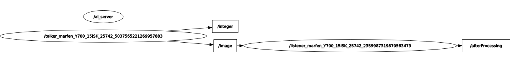

Bei diesem Projekt handelt es sich um die Implementierung der Prüfungsvorleistung Spezielle Anwendungen der Informatik  
der HTW Berlin mit folgender [Aufgabenstellung](https://gitlab.com/baumannpa_teaching/ros-ai-task)

Das Ziel ist eine Anwendung zur Handschrifterkennung mittels künstlicher Intelligenz.

-----

- [ROS Grundlagen](#ros-grundlagen)
    - [Nodes](#ros-nodes)
    - [Topics](#ros-topics)
    - [Messages](#ros-messages)
    - [Master](#ros-master)
- [Implementierung](#implementierung)
    - [Task 1](#task-1)
    - [Task 2](#task-2)
    - [Task 3](#task-3)
- [Ausführung](#ausführung)    

# ROS Grundlagen

ROS - kurz für Robot Operating System - ist ein Framework für Roboter dessen Entwicklung ursprünglich  
2007 am Stanford Artificial Intelligence Laboratory im Rahmen des Standford-AI-Projects (STAIR) begann 
und nun seit 2013 duch das ROS Industrial Consortium gefördert und unterstützt wird.

ROS ist eine Sammlung von Tools, Bibliotheken und Konventionen mit dem Ziel das Erstellen von komplexen  
und robusten Roboter Systemen zu vereinfachen

### ROS Nodes

Nodes sind zunächst einmal eigenständige Prozesse die bestimmte Dinge erledigen. Mehrere Nodes zusammen  
ergeben einen Graph und sie kommunizieren miteinander unter Verwendung von Topics, Messages und Services.  
ROS Anwendungen sollten möglichst fein granular mit vielen Nodes erstellt werden wobei jeder Node genau  
eine Aufgabe übernimmt

### ROS Topics

Ein Topic ist im Prinzip ein Bus über welchen Nodes Nachrichten austauschen. Um das zu realisieren wird das  
publisher-subscriber Prinzip verwendet. Einzelne Nodes können Nachrichten zu einem bestimmten Topic publizieren  
während andere Nodes die Topics abonnieren/subscriben können. Einzelne Nodes wissen dabei nicht zwingend mit  
welchen anderen Nodes sie dabei kommunizieren. Topics dienen der unidirektionalen Kommunikation, werden Antworten  
benötigt findet das Prinzip der Services anwendung.

### ROS Messages

ROS Messages beschreiben eine simple Datenstruktur zum Nachrichtenaustausch über Topics und Services. 
Sie enthalten zum Beispiel primitive Datentypen, können aber auch mit anderen Messages ineinander verschachtelt  
werden und mit einem Header mit Metadaten wie Zeitstempel versehen werden.  
Für Unidirektionale Kommunikation via Topics lautet die Dateiendung .msg. Die Erweiterung dazu für Services  
die ausserdem eine Response beinhalten haben die Endung .srv

### ROS Master

Der ROS Master stellt Namens und Registrierungsservices für die restlichen Nodes zur verfügung und verwaltet
publisher und subscriber von Topics und Services. Das Ziel ist es den anderen Nodes zu ermöglichen sich gegenseitig  
zu finden

# Implementierung

### Task 1

Nach dem ersten Teil der Aufgabe sieht der Graph der Anwendung folgendermaßen aus

Der Talker Node stellt die Kamera dar welche die Bilder oder den Videostream an den  
Processor(in diesem Fall listener genannt) zur weiteren Verarbeitung sendet. Dies wird realisiert durch das  
Publisher-Subscriber Prinzip. Die Kamera/talker published das Bild an das Topic "image" und der Prozessor/listener  
subscribed das Topic um die Nachrichten, also die Bilder zu erhalten. Der Prozessor Verarbeited die ankommenden Bilder  
und published diese anschließend selbst an das Topic "afterProcessing".  
Die Kamera/talker published ausserdem eine Custommessage(IntWithHeader.msg), bei der es sich um ein integer mit  
Header(notwendig zur späteren Synchronisierung) handelt, and das Topic "integer"

Zum Bauen der Anwendung muss der Befehl

> catkin_make

ausgeführt werden und anschließend kann die Anwendung mit

>roslaunch beginner_tutorials talker-listener.launch 

ausgeführt werden. Dafür wurde das File talker-listener.launch erstellt in welchem die zu startenden Nodes definiert
wurden.

### Task 2

### Task 3

