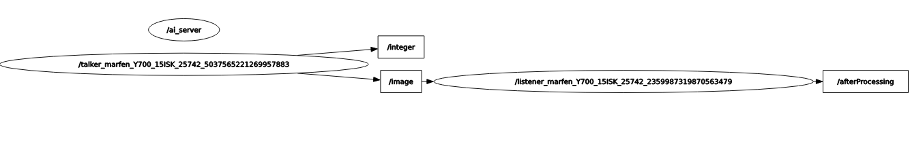
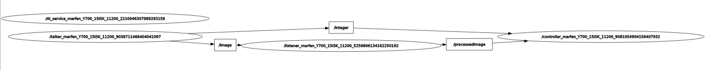
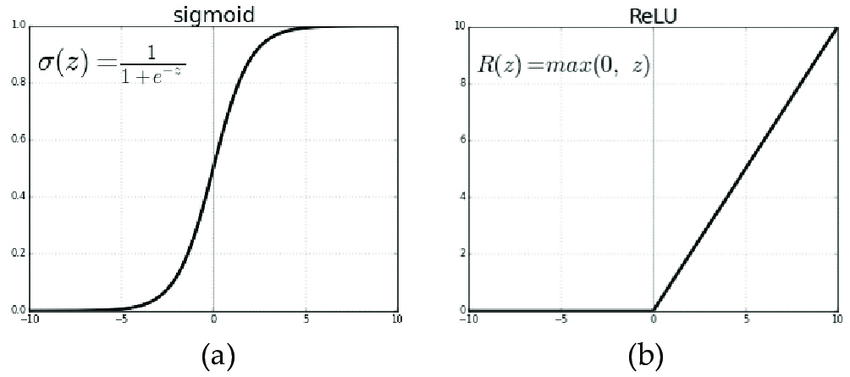

Bei diesem Projekt handelt es sich um die Implementierung der Prüfungsvorleistung Spezielle Anwendungen der Informatik  
der HTW Berlin mit folgender [Aufgabenstellung](https://gitlab.com/baumannpa_teaching/ros-ai-task)

Das Ziel ist eine Anwendung zur Handschrifterkennung mittels künstlicher Intelligenz.

Das unter Task 3 beschriebene und verwendete Model ist [hier](https://github.com/marfen/spezAnw-mnist) zu finden.

-----

- [Ausführung](#ausführung)   
- [Implementierung](#implementierung)
    - [Task 1](#task-1)
        - [ROS Grundlagen](#ros-grundlagen)
        - [Nodes](#ros-nodes)
        - [Topics](#ros-topics)
        - [Messages](#ros-messages)
        - [Master](#ros-master)
    - [Task 2](#task-2)
    - [Task 3](#task-3)
        - [ROS Anpassungen](#ros-anpassungen)
        - [Model trainieren](#model-trainieren)
            - [MNIST-Datensatz vorbereiten](#mnist-datensatz-vorbereiten)
            - [Model](#model)
            - [Training](#training) 
            - [Vergleich der Modelvarianten](#vergleich-unterschiedlich-trainierter-models)

---

# Ausführung 

### Model trainieren

Zunächst muss das Model trainiert werden, der Code dazu kann [hier](https://github.com/marfen/spezAnw-mnist)
gefunden werden.

Nachdem das Repository gecloned wurde, müssen zunächst die Dependencies installiert werden.

> pip install - requirements.txt

Anschließend kann das Training gestartet werden 

> python main.py

Die fertig trainierte Models werden nun im Ordner "persistent_models" als .pth abgelegt

### trainiertes Model in ROS einfügen 

Zum Benutzen der trainierten Models, müssen die im vorherigen Schritt erstellten und gespeicherten Models  
nun in diesem Repository unter "src/beginner_tutorials/pytorch_models/trained_models" abgelegt werden  

### ros starten

Falls nicht bereits zur .bashrc hinzugefügt muss folgender Befehl beim Start jeder neuen Konsole ausgefüht werden.  

> source /opt/ros/noetic/setup.bash

Zum Bauen der Anwendung muss der Befehl

> catkin_make

Das nach catkin_make automatisch erstellte devel/setup.bash skript muss ebenfalls gesourced werden

> source devel/setup.bash

ausgeführt werden und anschließend kann die Anwendung mit

>roslaunch beginner_tutorials talker-listener.launch 

ausgeführt werden. Dafür wurde das File talker-listener.launch erstellt in welchem die zu startenden Nodes definiert  
wurden.
---

# Implementierung

# Task 1

### ROS Grundlagen

ROS - kurz für Robot Operating System - ist ein Framework für Roboter dessen Entwicklung ursprünglich  
2007 am Stanford Artificial Intelligence Laboratory im Rahmen des Standford-AI-Projects (STAIR) begann 
und nun seit 2013 duch das ROS Industrial Consortium gefördert und unterstützt wird.  

ROS ist eine Sammlung von Tools, Bibliotheken und Konventionen mit dem Ziel das Erstellen von komplexen  
und robusten Roboter Systemen zu vereinfachen  

### ROS Nodes

Nodes sind zunächst einmal eigenständige Prozesse die bestimmte Dinge erledigen. Mehrere Nodes zusammen  
ergeben einen Graph und sie kommunizieren miteinander unter Verwendung von Topics, Messages und Services.  
ROS Anwendungen sollten möglichst fein granular mit vielen Nodes erstellt werden wobei jeder Node genau  
eine Aufgabe übernimmt  

### ROS Topics

Ein Topic ist im Prinzip ein Bus über welchen Nodes Nachrichten austauschen. Um das zu realisieren wird das  
publisher-subscriber Prinzip verwendet. Einzelne Nodes können Nachrichten zu einem bestimmten Topic publizieren  
während andere Nodes die Topics abonnieren/subscriben können. Einzelne Nodes wissen dabei nicht zwingend mit  
welchen anderen Nodes sie dabei kommunizieren. Topics dienen der unidirektionalen Kommunikation, werden Antworten  
benötigt findet das Prinzip der Services Anwendung.  

### ROS Messages

ROS Messages beschreiben eine simple Datenstruktur zum Nachrichtenaustausch über Topics und Services. 
Sie enthalten zum Beispiel primitive Datentypen, können aber auch mit anderen Messages ineinander verschachtelt  
werden und mit einem Header mit Metadaten wie Zeitstempel versehen werden.  
Für Unidirektionale Kommunikation via Topics lautet die Dateiendung .msg. Die Erweiterung dazu für Services  
die ausserdem eine Response beinhalten haben die Endung .srv  

### ROS Master

Der ROS Master stellt Namens und Registrierungsservices für die restlichen Nodes zur verfügung und verwaltet  
publisher und subscriber von Topics und Services. Das Ziel ist es den anderen Nodes zu ermöglichen sich gegenseitig  
zu finden  

### Implementierung 
Der Talker Node stellt die Kamera dar welche die Bilder oder den Videostream an den  
Processor(in diesem Fall listener genannt) zur weiteren Verarbeitung sendet. Dies wird realisiert durch das  
Publisher-Subscriber Prinzip. Die Kamera/talker initialisiert je einen Publisher für jedes Topic, wandelt die Bilder  
in Messages vom Typ Image des Pakets sensor_msgs um und published die Message anschließend an das Topic "image".  
Für den Integer wurde eine Custom-Message namens IntWithHeader erstellt, diese enthält einen Header und int32, im  
talker/Kamera wird nun ein IntWithHeader Objekt erzeugt und das int32 Feld mit einem beliebigen Integer   
initialisiert und an das Topic "integer" gepublished.  

Der Listener/Prozessor Node enthält die Funktion listener() in welcher ein Subscriber auf das Topic "image"  
initialisiert wird und eine Message vom Typ Image erwartet. Die erhaltene Image Message wird nun in der Callback  
Methode zunächst, wieder in ein Bild transformiert, anschließend in Graustufen umgewandelt und wieder in eine Image  
Message transformiert. Im nächsten Schritt wird ein neuer Publisher an das Topic "processedImage" initialisiert  
und die Message wird publiziert.  

Nach dem ersten Teil der Aufgabe sieht der Graph der Anwendung folgendermaßen aus  

# Task 2

In Aufgabe 2 wurde ein Controller Node hinzugefügt der die aus Aufgabe 1 erstellten Topics "integer" und  
"processedImage" subscribed und diese synchronisiert in einem Python dict() abspeichert um die Paare richtig  
zuordnen zu können. Die listener() Funktion des Skripts übernimmt den Part des subscribens und synchronisierens  
der eingehenden Messages. Die Image Message wird nun wieder in ein Bild umgewandelt und der Integer aus der   
IntWithHeader Message wird ebenfalls in einer variable gespeichert um beide anschließend im Dict() ablegen zu können.  

Im nächsten Schritt wurde der AI_service hinzugefügt, dieser soll später dazu genutzt werden die vorbereiteten   
Bilder vom Controller zu erhalten und mithilfe eines zuvor trainierten Models die jeweiigen Ziffern erkennen und   
sein Ergebnis an den Controller zurückzusenden.

Der Service ist nach einem Server-Client Prinzip umgesetzt wonach der AI_service selbst als Server dient und   
der Controller als Client. Beim Start des Servers wird ein Service mit dem Namen "number_prediction_service"  
initialisiert, und der zu verwendene Message Typ AI.srv und die auszuführende Methode "predictNumberFromImage"  
angegeben.  

Die AI.srv Message enthält für die Request an den Service wieder eine Image Message und als Antwort an den Client  
ein int32 mit dem Ergebnis der vorhersage. 

Die Methode predictNumberFromImage() die bei Anfragen an den Service ausgeführt wird nimmt die AI.srv Message  
entgegen, wandelt die Image Message wieder in ein Bild um und gibt zum aktuellen Zeitpunkt lediglich eine   
festgelegte Zahl als Integer zurück an den Client.  
 
Im Client, also dem Controller wurde die prediction_service_client() Methode hinzugefügt, welche eine Image Message  
entgegennimmt. Die Methode initialisiert unter Angabe des Namen des zu startenden Service und des zu verwendenden  
Message Typ einen Service Proxy und ruft diesen unter Angabe der zu untersuchenden Image Message auf und gibt die  
Antwort des Service zurück. Die Funktion wird am Ender der Callback Methode des Controller aufgerufen.  

Nach dem zweiten Teil der Aufgabe sieht der Graph folgendermaßen aus, die Verbindungen "processedImage" und "int"  
zwischen dem Controller und AI_service könne aufgrund eines Bugs leider nicht angezeigt werden  

# Task 3

## ROS Anpassungen

Für Aufgabe 3 wurden in der ROS Anwendung nur noch kleinere Änderungen vorgenommen.   

Der Talker wählt nun zufällig ein zu sendendes Bild aus dem MNSIT Datensatz.  
Desweiteren wurden sowohl das Skript zu erzeugung des Models als auch die bereits trainierten Models hinzugefügt,   
um dieses im AI_Service laden zu können.  
Im Controller werden nun die Vorhersage des AI_service und der wahre Wert des Talker/Kamera miteinander verglichen.  

## Model Trainieren

Klassifizierung mithilfe eines Convolutional Neural Network (CNN)

### MNIST Datensatz vorbereiten

Nachdem die Bilder in Tensoren transformiert werden müssen sie anschließend normalisiert werden.  
Dabei werden die vorhandenen Informationen auf einer neuen Skala von 0-1 abgebildet. Dies dient der Relativierung der  
Daten zur besseren Einordnung innrhalb eines gegebenen Sets. Dadurch können auch unterschiedliche Features auf der  
gleichen Skala eingeordnet werden. Eine weitere Bezeichnung für normalization ist daher feature scaling.  
    
In diesem Fall werden die Farbwerte des Bildes (Graustufen) normalisiert.  

## Model

Ein Model besteht aus verschiedenen Layern, der erste Layer wird Input Layer genannt, und ist in diesem Fall  
das Bild das zur Klassifizierung hineingegeben wird. Die dazwischen liegenden Layer werden hidden Layer genannt und  
der letzte Layer Output-Layer. Der Output Layer besteht in diesem Fall aus den Ziffern 0-9 die entsprechend aus den  
Input Bildern erkannt werden sollen.  

Jeder Layer gibt seinen Output als als Input an die nächste Schicht weiter wobei jede Verbindung zwischen den  
Neuronen einen Wert zwischen 0-1, das Gewicht, zugewiesen bekommt. Für jede Verbindung zu einem Neuron, wird nun  
der Wert des Input  mit dem Gewicht multipliziert und so die gewichtete Summe gebildet welche anschließend an eine  
Activation Function weitergegeben wird die die Summen in Werte zwischen 0 und 1 transformiert, dieses Ergebnis wird  
nun wiederum als Input an die Neuronen der nächsten Layer weitergegeben. Dieser Prozess wird über die verschiedenen  
Layer hinweg durchgeführt bis der Output erreicht wird. Beim Trainingsprozess ändern sich die Gewichte ständig um  
Optimale ergebnisse zu erzielen.  

Das Model ist aufgebaut in folgenden Layern  

    super(Model1, self).__init__()
        self.conv1 = Conv2d(1, 10, 5)       1 input, 10 output
        self.conv2 = Conv2d(10, 20, 5)      10 input (=output layer davor), 20 output
        self.fc1 = Linear(320, 80)          320 input (= 4 x 4 x 20), 80 output, zufällig gewählt
        self.fc2 = Linear(80, 10)           80 input (=output layer davor), output 10 (Ziffern 0-9)

### forward function

    def forward(self, x):
        x = self.conv1(x)
        x = F.max_pool2d(x, 2)              # 2x2 pooling, max Werte
        x = self.conv2(x)
        x = F.max_pool2d(x, 2)

        x = x.view(-1, 320)                 #ignoriert 1. Dimension und legt 320 pixel nebeneinander
        x = F.sigmoid(self.fc1(x))
        x = F.sigmoid(self.fc2(x))
        return F.log_softmax(x, dim=1)      # höchster output wird 1 gesetzt, Rest auf 0 (Klassifizierung)

### Convolutional Layer

Ein Convolutional Layer dient dazu die Komplexität eines Bildes zu verringern und macht sich dazu die Tatsache zu   
nutzen dass nur zwischen nah beieinander liegenden Pixeln eine Relation besteht, und erhält dadurch die Beziehungen  
von unterschiedlichen Bildbereichen zueinander.  
Eine Convolution verkleinert das Bild sozusagen mit einem Pixelfilter.  
Wird zum Beispiel ein 5x5 Bild mit einem 3x3 Filter auch Faltungsmatrix genannt, bei einem Stride(Verschiebung des   
Filters bei jedem Schritt) von 1x1 verkleinert, erhält man wiederum ein 3x3 Bild. Dabei wird die Filter Matrix an  
das obere linke Eck des Bildes angelegt und die Produkte aller übereinanderliegenden Zellen addiert, die summe  
wird nun in das erste Feld der Ergebnismatrix eingetragen. Anschließend wird der Filter um eine Zelle nach rechts  
verschoben und wieder alle Produkte der übereinanderliegenden Zellen addiert, das Ergebnis in der Ergebnismatrix  
ebenfalls um eine Zelle verschoben eingetragen und anschließend der Filter verschoben.  
Wird dies nun ein weiters mal angewendet befindet man sich mit dem Filter nun am rechten Ende der Ausgangsmatrix,  
 und die Ergebnismatrix hat 3 Zellen in der erste Zeile, nun wird der Filter bei der Verschiebung in der Zeiten  
Zeile und ersten Spalte der Ausgangsmatrix angesetzt, und das Ergebnis in der Zielmatrix ebenfalls in der zweiten   
Zeile und ersten Spalte eingetragen. Wird dieses Verfahren nun so weiterverfolgt erhält man zum Schluss die  
3x3 Ergebnismatrix, in der die Verhältnisse der einzelnen Berreiche weiterhin bestand haben.   

In einem Convolutional Layer werden nun die Zellen der Ausgangsmatrix als Neuronen bezeichnet und die Zellen der  
Faltungsmatrix werden nach dem gleichen Verschiebungsschema als Gewichte für die nächsten Layer eingetragen, 
wobei bedingt durch den Prozess oft die gleichen Gewichte eingetragen werden.  

### Pooling Layer 
 
Nach jedem Convolutional Layer wird zur weiteren reduzierung der Komplexität durch Verkleinerung der Größe und  
Reduzierung der Parameter ein Poolinglayer eingesetzt.   
Beim Pooling werden Bereiche nach vorgegebener Poolingsize zusammengefasst und entweder das Maximum, der  
Durchschnitt, oder die Summe der Gewichte weiterverwendet. In diesem Fall beträgt die Poolingsize 2x2 und es  
werden die Maximal-Werte der Gewichte weiterverwendet.  
   
### Fully Connected (Linear) Layer

Nachdem der Input durch die Convolutional und Pooling Layer vorbereitet und vereinfacht wurde, auch Feature Learning 
genannt, dient der Fully Connected Layer nun zur Klassifizierung, dazu ist jeder Input mit jedem Output verbunden  
um die tatsächlichen Relationen und Effekte der einzelnen Parameter zueinander zu bestimmen. 

### Activation Function

Activation Functions definieren den Output eines jeden Neurons basierend auf einem Set von Inputs, die gewichteten  
Summen jeder Verbindung zum gleichen Neuron in der darauffolgenden Schicht werden an die Activation Function 
weitergegeben.  
Die Activation Function bestimmt die Aktivierung jedes Neurons und dadurch welche Neuronen "feuern"(1) und welche   
nicht(0). 

Grundsätzlich wird unterschieden zwischen linearen und nicht-linearen Activation Functions, wobei die linearen  
für komplexe Probleme nicht geeignet sind und deshalb hauptsächlich nicht-lineare verwendet werden.  

Für diese Arbeit wurden zwei Modelle mit unterschiedlichen Activation Functions getestet um diese zu vergleichen.  

  
[Quelle](https://www.researchgate.net/figure/Comparison-of-two-commonly-used-activation-functions-29-a-Sigmoid-b-ReLU_fig2_331325639)

### sigmoid

Aufgrund des sogenannten Vanishing Gradient Problems eignet sich Sigmoid eigentlich nicht für komplexere  
Klassifizierung. Während der Backpropagation werden die Gradients immer kleiner bis sie irgendwann komplett  
verschwinden, und ohne Gradients kann kein lernen mehr stattfinden.  
Da es sich hierbei allerdings um eine sehr einfache Form der Klassifizierung handelt wollte ich es dennoch testen, 
wie sich die Sigmoid Function verhält.

Die Sigmoid Funktion transformiert jeden Input in einen Wert zwischen 0 und 1, ist der Input dabei negativ liegt das  
Ergebnis der Transformation näher 0 je kleiner die Summe ist, für positive Inputs liegt das Ergebnis näher an 1 je  
größer die Summe ist. br>
Das Problem dabei ist dass hohe Summen immer bei 1 gekappt werden und kleine bei 0, wirklich sensitiv ist die  
Funktion daher nur im Bereich des Mittelpunkts 0,5. Es wird daher beim Training immer schwerer die Gewichte weiter   
anzupassen.  

In großen Netzen werden so Fehler bei der Backpropagation durch das Netz getragen und zum updaten der Gewichte verwendet.  
        
### Rectified Linear Unit Function - Relu

Die Relu Function bietet hier mehr Spielraum für Sensitivität da sie den Input direkt als Output weiterreicht wenn  
dieser positiv ist, und auf 0 setzt falls der Input 0 oder kleiner ist.

### Softmax 

Die Softmax Function betrachtet alle Gewichte des Outputs (Ziffern 0-9) und setzt den höchsten auf 1 und den Rest  
auf 0. Der Output der nun auf 1 steht ist das Ergebnis der Klassifizierung.

## Training

Das bisher erstellte Model ist noch nicht optimiert und bildet ein quasi leeres CNN (Convoltional Neural Network)  
dass im nächsten Schritt noch Trainiert werden muss.
    
### Loss Function
    NLL-Loss
### Optimizer

    SGD
  
## vergleich unterschiedlicher Models

### Model1 mit Sigmoid Activation Function

### Model2 mit ReLu Activation Function

